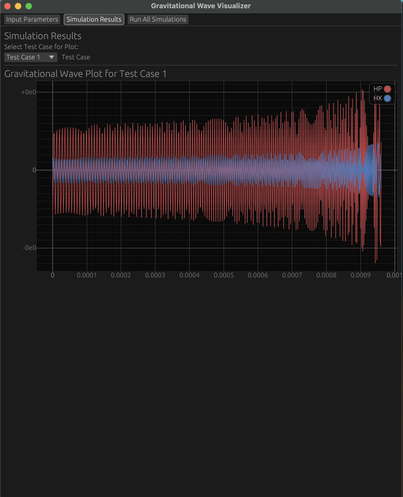

<!-- Improved compatibility of back to top link: See: https://github.com/othneildrew/Best-README-Template/pull/73 -->
<a id="readme-top"></a>
<!--
*** Thanks for checking out the Best-README-Template. If you have a suggestion
*** that would make this better, please fork the repo and create a pull request
*** or simply open an issue with the tag "enhancement".
*** Don't forget to give the project a star!
*** Thanks again! Now go create something AMAZING! :D
-->


<!-- PROJECT SHIELDS -->
<!--
*** I'm using markdown "reference style" links for readability.
*** Reference links are enclosed in brackets [ ] instead of parentheses ( ).
*** See the bottom of this document for the declaration of the reference variables
*** for contributors-url, forks-url, etc. This is an optional, concise syntax you may use.
*** https://www.markdownguide.org/basic-syntax/#reference-style-links
-->
[![Contributors][contributors-shield]][contributors-url]
[![Forks][forks-shield]][forks-url]
[![Stargazers][stars-shield]][stars-url]
[![Issues][issues-shield]][issues-url]
[![MIT License][license-shield]][license-url]
[![LinkedIn][linkedin-shield]][linkedin-url]


<!-- PROJECT LOGO -->
<br />
<div align="center">
  <a href="[[https://github.com/github_username/repo_name](https://github.com/William-Metz/rustylisa)](https://github.com/William-Metz/rustylisa.git)">
    
  </a>

<h3 align="center">Rusty LISA</h3>

  <p align="center">
    A gravitational waveform generator built in Rust
    <br />
    <a href="https://lisaresearch.sites.pomona.edu/"><strong>Explore the docs »</strong></a>
    <br />
    <br />
    <a href="https://github.com/William-Metz/rustylisa">View Demo</a>
    ·
    <a href="https://github.com/William-Metz/rustylisa/issues/new?labels=bug&template=bug-report---.md">Report Bug</a>
    ·
    <a href="https://github.com/William-Metz/rustylisa/issues/new?labels=enhancement&template=feature-request---.md">Request Feature</a>
  </p>
</div>


<!-- TABLE OF CONTENTS -->
<details>
  <summary>Table of Contents</summary>
  <ol>
    <li>
      <a href="#about-the-project">About The Project</a>
      <ul>
        <li><a href="#built-with">Built With</a></li>
      </ul>
    </li>
    <li>
      <a href="#getting-started">Getting Started</a>
      <ul>
        <li><a href="#prerequisites">Prerequisites</a></li>
        <li><a href="#installation">Installation</a></li>
      </ul>
    </li>
    <li><a href="#usage">Usage</a></li>
    <li><a href="#roadmap">Roadmap</a></li>
    <li><a href="#contributing">Contributing</a></li>
    <li><a href="#license">License</a></li>
    <li><a href="#contact">Contact</a></li>
    <li><a href="#acknowledgments">Acknowledgments</a></li>
  </ol>
</details>


<!-- ABOUT THE PROJECT -->
## About The Project
RustyLISA is a project that aims to simulate gravitational waves, particularly those detected by the Laser Interferometer Space Antenna (LISA). This project is the continuation of a long-running Physics Research at Pomona College, headed by Thomas Moore, which initially built a simulator with a team of undergraduate researchers using XOJO. The main goal of the RustyLISA project is to leverage Rust's performance and reliability to create a faster and more feature-rich GW simulator to empower researchers with the tools to do cutting-edge research.
<p align="right">(<a href="#readme-top">back to top</a>)</p>


<!-- GETTING STARTED -->
## Getting Started

### Prerequisites

* Install rust
  ```sh
  curl --proto '=https' --tlsv1.2 -sSf https://sh.rustup.rs | sh
  ```

### Installation

1. Clone the repository and cd in
   ```sh
   git clone https://github.com/William-Metz/rustylisa.git
   cd rustylisa
   ```

2. Build release
   ```sh
   cargo build --release
   ```
3. Run build
   ```sh
   ./target/release/rustylisa
   ```
<p align="right">(<a href="#readme-top">back to top</a>)</p>


<!-- USAGE EXAMPLES -->
## Usage

## Examples

Below are some example screenshots demonstrating the functionality of this project:

### Simulation Results


This image shows the results of a simulation run, displaying `HP` and `HX` graphs.

### Change Results


This screenshot shows how to change between different test cases when viewing their results.

### Running All Tests


Here, we see an example of hitting the `Run All Simulations` button to run all the test cases.

### Individual Test Case


This image provides a look at an individual test case.


_For more examples, please refer to the [Documentation](https://lisaresearch.sites.pomona.edu/)_

<p align="right">(<a href="#readme-top">back to top</a>)</p>


<!-- ROADMAP -->
## Roadmap
 
| Variable Name | Symbol     | Type | Description                                                          | Input Range       | Default Value |
|---------------|------------|------|----------------------------------------------------------------------|-------------------|---------------|
| M             | M          | f64  | Total mass of the binary system in units of solar masses             | M > 1            | 100000         |
| delta         | δ          | f64  | Asymmetry in mass ratio, calculated as \( \frac{m_1 - m_2}{M} \)     | -1.0 < δ < 1.0   | 0.1           |
| t_0           | t₀         | f64  | Initial period of the binary system in Light years                   | 10 to 10,000 ly   | 100.0      |
| R             | R          | f64  | Distance to the binary system from the detectors                     | \( R > 0 \)      | 10000000.0        |
| beta_         | β          | f64  | Inclination angle between the orbital angular momentum and line of sight | 0° to 180°   | 39.0°         |
| psi           | ψ          | f64  | Precession phase angle, describing the orbital plane's orientation   | 0° to 360°       | 24.0°          |
| lambda0       | λ₀         | f64  | Initial orbital phase or mean longitude                              | 0° to 360°       | 0.0°          |
| theta_        | θ          | f64  | Polar angle for binary orientation relative to a reference axis      | 0° to 180°       | 5.0°         |
| phi_          | ϕ          | f64  | Azimuthal angle for binary orientation in the reference plane        | 0° to 360°       | 268.5°          |
| chi1          | χ₁         | f64  | Dimensionless spin parameter of the first object                     | 0 to 1           | 0.0          |
| theta_1       | θ₁         | f64  | Polar angle of the first object's spin vector                        | 0° to 180°       | 90.0°         |
| phi_1         | ϕ₁         | f64  | Azimuthal angle of the first object's spin vector                    | 0° to 360°       | 0.0°          |
| chi2          | χ₂         | f64  | Dimensionless spin parameter of the second object                    | 0 to 1           | 0.5           |
| theta_2       | θ₂         | f64  | Polar angle of the second object's spin vector                       | 0° to 180°       | 90.0°         |
| phi_2         | ϕ₂         | f64  | Azimuthal angle of the second object's spin vector                   | 0° to 360°       | 0.0°          |
| rho_0         | ρ₀         | f64  | Initial separation distance or radial parameter for orbit            | \( ρ₀ > 0 \)     | 1.0           |
| pn_order      | Post Newtonian Order | i32  | Order of the Post-Newtonian expansion used in the model      0 to 3          | 0             |
| detectors     | detectors  | i32  | Number of detectors or observatories used in observing the system    | \( \geq 1 \)     | 1             |
| delta_t       | Δt         | f64  | Time step size or resolution for simulation                          | \( Δt > 0 \)     | 0.1           |
| duration      | duration   | f64  | Total duration of the waveform or simulation                         | \( \geq Δt \)    | 100.0         |
- [ ] Feature 1
- [ ] Feature 2
- [ ] Feature 3
    - [ ] Nested Feature

See the [open issues](https://github.com/William-Metz/rustylisa/issues) for a full list of proposed features (and known issues).

<p align="right">(<a href="#readme-top">back to top</a>)</p>


<!-- CONTRIBUTING -->
## Contributing

Contributions are what make the open source community such an amazing place to learn, inspire, and create. Any contributions you make are **greatly appreciated**.

If you have a suggestion that would make this better, please fork the repo and create a pull request. You can also simply open an issue with the tag "enhancement".
Don't forget to give the project a star! Thanks again!

1. Fork the Project
2. Create your Feature Branch (`git checkout -b feature/AmazingFeature`)
3. Commit your Changes (`git commit -m 'Add some AmazingFeature'`)
4. Push to the Branch (`git push origin feature/AmazingFeature`)
5. Open a Pull Request

<p align="right">(<a href="#readme-top">back to top</a>)</p>

### Top contributors:

<a href="https://github.com/github_username/repo_name/graphs/contributors">
  
</a>


<!-- LICENSE -->
## License

Distributed under the MIT License. See `LICENSE.txt` for more information.

<p align="right">(<a href="#readme-top">back to top</a>)</p>


<!-- CONTACT -->
## Contact

Will Metz - williamesmetz@gmail.com

Project Link: [https://github.com/github_username/repo_name](https://github.com/github_username/repo_name)

<p align="right">(<a href="#readme-top">back to top</a>)</p>


<!-- ACKNOWLEDGMENTS -->
## Acknowledgments

* [Thomas Moore]()
* []()
* []()

<p align="right">(<a href="#readme-top">back to top</a>)</p>


<!-- MARKDOWN LINKS & IMAGES -->
<!-- https://www.markdownguide.org/basic-syntax/#reference-style-links -->
[contributors-shield]: https://img.shields.io/github/contributors/William-Metz/rustylisa.svg?style=for-the-badge
[contributors-url]: https://github.com/William-Metz/rustylisa/graphs/contributors
[forks-shield]: https://img.shields.io/github/forks/William-Metz/rustylisa.svg?style=for-the-badge
[forks-url]: https://github.com/William-Metz/rustylisa/network/members
[stars-shield]: https://img.shields.io/github/stars/William-Metz/rustylisa.svg?style=for-the-badge
[stars-url]: https://github.com/William-Metz/rustylisa/stargazers
[issues-shield]: https://img.shields.io/github/issues/William-Metz/rustylisa.svg?style=for-the-badge
[issues-url]: https://github.com/William-Metz/rustylisa/issues
[license-shield]: https://img.shields.io/github/license/William-Metz/rustylisa.svg?style=for-the-badge
[license-url]: https://github.com/William-Metz/rustylisa/blob/main/LICENSE
[linkedin-shield]: https://img.shields.io/badge/-LinkedIn-black.svg?style=for-the-badge&logo=linkedin&colorB=555
[linkedin-url]: https://www.linkedin.com/in/william-metz/
[product-screenshot]: images/screenshot.png
[Next.js]: https://img.shields.io/badge/next.js-000000?style=for-the-badge&logo=nextdotjs&logoColor=white
[Next-url]: https://nextjs.org/
[React.js]: https://img.shields.io/badge/React-20232A?style=for-the-badge&logo=react&logoColor=61DAFB
[React-url]: https://reactjs.org/
[Vue.js]: https://img.shields.io/badge/Vue.js-35495E?style=for-the-badge&logo=vuedotjs&logoColor=4FC08D
[Vue-url]: https://vuejs.org/
[Angular.io]: https://img.shields.io/badge/Angular-DD0031?style=for-the-badge&logo=angular&logoColor=white
[Angular-url]: https://angular.io/
[Svelte.dev]: https://img.shields.io/badge/Svelte-4A4A55?style=for-the-badge&logo=svelte&logoColor=FF3E00
[Svelte-url]: https://svelte.dev/
[Laravel.com]: https://img.shields.io/badge/Laravel-FF2D20?style=for-the-badge&logo=laravel&logoColor=white
[Laravel-url]: https://laravel.com
[Bootstrap.com]: https://img.shields.io/badge/Bootstrap-563D7C?style=for-the-badge&logo=bootstrap&logoColor=white
[Bootstrap-url]: https://getbootstrap.com
[JQuery.com]: https://img.shields.io/badge/jQuery-0769AD?style=for-the-badge&logo=jquery&logoColor=white
[JQuery-url]: https://jquery.com 
